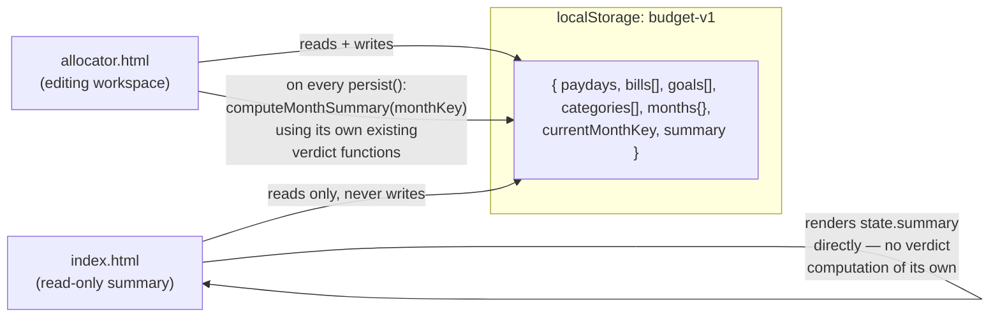

# Unify Budget Data Across Cash Flow Planner and Paycheck Allocator

## Overview

`index.html` and `allocator.html` currently keep fully separate data under separate `localStorage` keys, with incompatible bill/income shapes. This plan unifies them into one shared data store: `allocator.html` remains the sole editing workspace (bills with due dates, two-paycheck income, goals, categories, logged entries, month navigation); `index.html` becomes a read-only, 3-card monthly summary. Rather than extracting verdict logic into a shared script both pages compute from (the mechanism the origin document specified), `allocator.html` computes the correct combined monthly summary itself — using its own existing verdict logic, with one small correctness fix — and persists the result as plain numbers. `index.html` reads those numbers directly, with zero verdict computation of its own. See "Superseded Decision" under Key Technical Decisions for why this replaces the originally-specified shared-script approach.

## Problem Frame

See origin document for full problem framing. In short: double entry of the same bills/income across two pages, and no single "what does my whole month look like" view that also reflects paycheck-by-paycheck planning. This is a deliberate reversal of the original `allocator.html` plan's boundary ("not replacing or modifying `index.html`") — an informed reversal, not an oversight (see origin: docs/brainstorms/2026-08-10-unified-budget-data-requirements.md).

## Requirements Trace

- R1. Bills, income, goals, and categories become one shared data source used by both pages.
- R2. Bills carry a due date (`dueDay`) in the unified model; `index.html`'s due-date-less bill shape is retired.
- R3. Income becomes exactly two paycheck amounts (`p1`, `p2`) per month; `index.html`'s itemized income list is retired.
- R4. Goals and categories become part of the shared data and factor into `index.html`'s rollup.
- R5. Both pages track one shared "currently viewed month."
- R6. No migration of existing data — clean-slate data model change.
- R7. `index.html` becomes read-only: total income (`p1`+`p2`), total bills, and "Remaining" = the sum of `allocator.html`'s two per-paycheck verdicts (not a separate whole-month formula). **Computed by `allocator.html` and persisted, not recomputed by `index.html` — see Superseded Decision.**
- R7a. `index.html` collapses to 3 summary cards only — no itemized bill/income list.
- R8. `index.html`'s Remaining card gains a neutral "awaiting income" state, in addition to its existing positive/negative styling.
- R9. `index.html` retains its cross-link to `allocator.html` (and vice versa).
- R9a. **Superseded during planning** — originally "verdict/priority-funding logic is extracted into a shared script file both pages load." Replaced by: `allocator.html` computes the summary once and persists it; `index.html` has no verdict logic to duplicate or share in the first place. This satisfies R9a's underlying intent (no duplicated verdict logic across pages) more completely than the literal shared-script mechanism would have. See Key Technical Decisions.
- R9b. `index.html`'s "days left in the month" header text only applies when the shared viewed month is the real current calendar month.
- R9c. `index.html`'s existing "different month" confirm() dialog is retired.
- R10. `allocator.html` keeps all of its existing editing capability with unchanged behavior, beyond reading/writing the newly-shared data shape (see Key Technical Decisions for the two accepted exceptions: persisted month navigation, and the goal-funding correctness fix).

## Scope Boundaries

- No migration of pre-existing `localStorage` data from either page — clean-slate change (see Documentation / Operational Notes for the recommended pre-ship backup step).
- `index.html` does not gain per-paycheck breakdown, due-date editing, goal/category management, or entry logging.
- No changes to `allocator.html`'s own displayed verdict labels, paycheck-level UI, or editing behavior. This plan does change `allocator.html`'s internal verdict computation in two ways: (a) reading/writing the unified data shape, (b) a small, additive correctness fix to `verdictFromIncomeAndCosts` (see Key Technical Decisions) that adds goal-funding data to a return branch that previously omitted it — existing fields and `allocator.html`'s own rendering of them are unchanged, this only adds a new field. Also: (c) persisting month navigation, and (d) computing and persisting a month-level summary on every save.
- Does not merge the two pages into one page/URL.
- `activeCycle`'s existing behavior (derived from the real current date rather than the viewed month) is unchanged — a pre-existing quirk. Persisting month navigation (R5) makes this quirk visible more often than before (a user returning on a later day now lands on their last-viewed month rather than always today), which is called out explicitly here as an accepted side effect, not a silent regression.

### Deferred to Separate Tasks

- Updating the Zapier/Sheets export feature (`docs/plans/2026-08-10-002-feat-zapier-sheets-budget-sync-plan.md`) to work against the unified data shape: once `index.html` is read-only and shares `allocator.html`'s store, its Export button has no independent state of its own to export. Whether it re-exports the shared store, is removed, or is merged into one export needs its own decision — not resolved here since it's a bigger question than a field-mapping tweak (see origin document's Outstanding Questions). `index.html`'s existing Export button is left as-is by this plan (still present, now exporting the shared schema's shape by virtue of `index.html` reading the shared store) — no code changes are made to it here.

## Context & Research

### Relevant Code and Patterns

**`allocator.html`'s verdict/funding call chain** (unchanged in location — no extraction in this revised approach; `computeMonthSummary`, the one new function this plan adds, is a peer to these, not a replacement):
- `roundCents(n)` — `allocator.html:477` — pure.
- `assignCycle(dueDay, p1, p2)` — `allocator.html:499-501` — pure; cycle 1 if `dueDay >= p1 && dueDay < p2`, else cycle 2.
- `getOrCreateMonth(state, monthKey)` — `allocator.html:462-465` — already takes `state` as an explicit parameter; no change needed.
- `computeCycleBuckets(monthKey, cycle)` — `allocator.html:503-537` — bills + categories folded into one budgeted/overage total for that cycle; nested `processBucket` helper (line 509). Closes over module-level `state` — left as-is since this plan no longer extracts these functions.
- `fundGoals(goalTargets, remainingStart)` — `allocator.html:539-547` — pure, funds goals top-down by priority.
- `classifyVerdict(goalResults, remainingAfter)` — `allocator.html:549-554` — pure.
- `verdictFromIncomeAndCosts(income, budgetedAndOverage, goalTargets)` — `allocator.html:556-563` — **gets the one correctness fix this plan makes** (Unit 2): its `bills-exceed-income` branch (line 557-559) currently returns without ever calling `fundGoals`, so that cycle's goal-funding data is silently omitted rather than recorded as unfunded. Verified against actual code and confirmed with a worked example during planning: for a cycle where bills alone exceed that cycle's income, goal targets for that cycle vanish from the computation entirely rather than counting as shortfall.
- `goalTargetForCycle(goal, cycle)` — `allocator.html:565-571` — pure; deliberately derives cycle 2's target as the remainder of cycle 1's rounded half, so the two cycles' goal funding sums exactly to the full target.
- `computeCycleVerdict(monthKey, cycle)` — `allocator.html:573-585` — the per-paycheck verdict, used both by `allocator.html`'s own paycheck cards (unchanged) and by the new `computeMonthSummary` (Unit 3).
- `computeMonthVerdict(monthKey)` — `allocator.html:587-599` — unchanged, still `allocator.html`-only, still not used for `index.html`'s figure.

**`allocator.html`'s current data model** (`STORAGE_KEY = 'goal-paycheck-planner-v1'`, `allocator.html:400`):
- `state.paydays = { p1, p2 }` (day-of-month ints, via `defaultState()` at `allocator.html:403-411`).
- `state.goals[] = { id, name, target }` (created `allocator.html:926`).
- `state.bills[] = { id, name, amount, dueDay }` (created `allocator.html:927`).
- `state.categories[] = { id, name, amount }` (created `allocator.html:928`) — always split `amount / 2` per cycle, unconditionally (`allocator.html:525`).
- `state.months{}` keyed `"YYYY-MM"`, each = `{ income: { p1, p2 }, entries: [] }` via `emptyMonth()` (`allocator.html:413-415`).
- Month navigation: `monthKey` (`allocator.html:610`) is a plain JS variable today, reset to the real current month on every load — `prev-month`/`next-month` handlers (`allocator.html:916-917`) never persist it.
- `loadState()` (`allocator.html:417-446`) builds its return object field-by-field from `parsed` rather than spreading it — any new top-level field (like the `currentMonthKey`/`summary` this plan adds) must be explicitly read back out here, or a previously-persisted value is silently dropped on every load. Confirmed by reading the actual return statement during planning.

**`index.html`'s current data model and render logic** (`STORAGE_KEY = 'budgetPlanner-v1'`, `index.html:302`):
- `state.month` (string), `state.income[] = { id, label, amount }`, `state.bills[] = { id, label, amount }` (no due date).
- `getMonthLabel()` (`index.html:312-315`) and `getDaysRemaining()` (`index.html:321-325`) both currently derive from `new Date()` (wall-clock), not from any persisted month — both need to switch to reading the shared viewed month once that becomes navigable, or the header will show the wrong month name while the cards show a different month's numbers.
- Summary render: `renderSummary()` (`index.html:401-412`) sets `#total-income`/`#total-bills`/`#remaining`, toggles `.positive`/`.negative` on `#remaining-card`.
- `loadState()` (`index.html:339-369`) does **not** currently call `saveState()`/`localStorage.setItem` anywhere — `saveState()` is a separate function (`index.html:371-373`) only called from the form-submit handlers, which this plan removes entirely. (Corrected during review: an earlier draft of this plan incorrectly described `loadState()` itself as having a habit of re-persisting on load; it doesn't. The "`index.html` never writes" invariant below is a new property being introduced as those form handlers are deleted, not a fix to an existing bug.)
- To remove: `#income-form`/`#bills-form` (`index.html:283-297`, listeners `index.html:508-528`), itemized-list machinery (`renderEntryRow`/`renderList`/`updateEntry`/`deleteEntry`/`addEntry`, `index.html:414-506`).
- To retire: the "your saved data is from a different month" `confirm()` dialog inside `loadState()` (`index.html:347-359`).

**Cross-page links** (unchanged): `index.html:259` → `<a href="allocator.html" ...>Paycheck Allocator →</a>`; `allocator.html:335` → `<a class="page-link" href="index.html">← Monthly Cash Flow Planner</a>`.

### Institutional Learnings

No `docs/solutions/` directory exists in this repo.

## Key Technical Decisions

- **Superseded decision — no shared script file.** The origin document's R9a specified extracting verdict/priority-funding logic into a shared `<script src>` file both pages load. During planning, a review surfaced two issues with that approach: (1) it requires reworking several functions to take `state` as a parameter instead of a closure, adding surface area for subtle behavioral drift in `allocator.html`'s existing paycheck cards; (2) a simpler alternative exists — since `allocator.html` already recomputes verdicts on every edit for its own UI, it can also compute the month-level combined summary at that same moment and persist it as plain numbers, leaving `index.html` with zero verdict logic of its own. This is strictly simpler (no new file, no parameterization, no shared-script risk) and satisfies R9a's actual goal (avoid duplicated verdict logic) more completely, since there is no logic on the `index.html` side to duplicate or share in the first place.
- **Correctness fix to `verdictFromIncomeAndCosts`'s `bills-exceed-income` branch**: it now also calls `fundGoals(goalTargets, 0)` and includes the (all-zero-funded) `goals` result, rather than omitting goal data entirely. This is additive only — the existing `status`/`shortfall` fields and everything `allocator.html`'s own per-cycle cards currently render are unchanged. Verified with a worked example during planning (cycle 1: income $300, bills $500, goal target $100 → previously the $100 goal contribution vanished from the month's combined total; with the fix, `computeMonthSummary`'s combining formula correctly counts it as unfunded, matching a true pooled whole-month calculation).
- **New function `computeMonthSummary(monthKey)`** (added to `allocator.html`, not extracted anywhere): calls `computeCycleVerdict(monthKey, 1)` and `computeCycleVerdict(monthKey, 2)`, then combines them: if either is `awaiting-income`, the summary's status is `awaiting`; otherwise each cycle converts to a signed net amount (`surplus` → `+surplus`; `break-even` → `0`; `short` → `-shortfall`; `bills-exceed-income` → `-(shortfall + sum of unfunded goal targets)`, using the fixed goal data) and the two nets sum to `remaining`. Also computes `totalIncome` (sum of both paychecks, or `null`/awaiting if either is unset — see the Total Income consistency decision below) and `totalBills` (sum of `state.bills[]`, bills-only, not categories).
- **`allocator.html` persists `state.summary = computeMonthSummary(monthKey)` inside `persist()`**, so every save keeps the shared summary current. `index.html` reads `state.summary` directly — no verdict computation, no `computeCycleVerdict` calls, on the read side at all.
- **Single shared `localStorage` key** (`budget-v1`), not two synced keys — since R6 already accepts no migration (clean slate), a single key directly satisfies "one shared data source" (R1) with zero sync logic.
- **`allocator.html`'s existing state shape becomes the unified schema**, extended with two new top-level fields: `currentMonthKey` (R5) and `summary` (the computed rollup `index.html` reads). Both must be explicitly read back out in `loadState()`'s return statement (see Context & Research) — adding them only to `defaultState()` is not sufficient, since `loadState()` doesn't spread `parsed`.
- **`index.html` never calls a save/persist function, under any circumstance.** It only reads `budget-v1` and renders. This is an explicit invariant to verify during Unit 4, not an assumption.
- **Total Income and Remaining show the same "awaiting" treatment for the same underlying incomplete data.** Originally, Total Income was going to sum `p1 + p2` treating any unset paycheck as `0` (showing a concrete, misleadingly-complete-looking number) while Remaining showed a neutral "awaiting" state for the same data — an inconsistency a reviewer caught. Fixed: if either paycheck's income is unset, both Total Income and Remaining show the neutral "awaiting" treatment.
- **`index.html`'s "Bills" card stays bills-only** (not folded with categories) — preserves its current, unambiguous meaning. Categories and goals both factor into "Remaining" (via `computeMonthSummary`) without a dedicated visible card (R7a locked "3 cards only, no itemized list" during brainstorm review) — an accepted tradeoff, previously flagged, where "Income − Bills" no longer visually equals "Remaining."
- **`index.html`'s header always shows the viewed month's name** (via `state.currentMonthKey`, not wall-clock `new Date()`), with the "days left" clause additionally shown only when the viewed month is the real current month. Fixes a gap where the header could otherwise show today's month name while the cards showed a different, persisted month's numbers.
- **The Remaining card's neutral state shows literal text "Awaiting income"** in place of a dollar figure (mirroring the plain-language style `allocator.html` already uses for its own awaiting-income paycheck cards).
- **`allocator.html`'s month navigation becomes persisted** (writes `currentMonthKey` on `prev-month`/`next-month`), so `allocator.html` now reopens on the last-viewed month rather than always defaulting to the real current month on reload — an accepted, deliberate consequence of R5, confirmed with the user during planning.
- **Both pages default to the real current month only when `currentMonthKey` has never been set** (true first-ever load).

## Open Questions

### Resolved During Planning

- Storage mechanism: one shared key (`budget-v1`), not two synced keys.
- Shared-logic mechanism: `allocator.html` computes and persists the summary; no shared script file, no extraction — supersedes R9a's literal mechanism (see Key Technical Decisions).
- Goal-funding gap in `bills-exceed-income`: fixed additively in `verdictFromIncomeAndCosts`, verified against a worked example.
- Whether `index.html` ever writes: never.
- Whether "Bills" card includes categories: no.
- Total Income vs. Remaining consistency for unset income: both show "awaiting," not just Remaining.
- Header month-name source: always the viewed month (`currentMonthKey`), not wall-clock — only the "days left" clause is conditional on viewing the real current month.
- Awaiting-income card content: literal text "Awaiting income" replacing the dollar figure.
- Whether `allocator.html`'s reload-to-real-current-month behavior changes: yes, deliberately, confirmed with the user.

### Deferred to Implementation

- Exact shape of `state.summary` beyond the fields named in Key Technical Decisions (e.g., whether it's worth including the raw per-cycle breakdown for future debugging, though `index.html` itself only needs the combined figures) — a minor sizing detail.
- Whether to add a one-line `localStorage.removeItem` cleanup for the two old keys (`budgetPlanner-v1`, `goal-paycheck-planner-v1`) — nice-to-have hygiene, not required by any requirement.
- First-visit empty state for `index.html` (before `allocator.html` has ever been used, or on a genuinely empty month): three cards showing $0/awaiting is functionally correct per this plan's requirements; whether it deserves additional onboarding messaging is a polish question, not a blocker, for a single-user personal app.

## High-Level Technical Design

> This illustrates the intended approach and is directional guidance for review, not implementation specification.



`computeMonthSummary`, as a sketch (directional, not literal code):

```
function computeMonthSummary(monthKey):
    v1 = computeCycleVerdict(monthKey, 1)
    v2 = computeCycleVerdict(monthKey, 2)

    if v1.status == 'awaiting-income' or v2.status == 'awaiting-income':
        return { status: 'awaiting' }

    net(v) =
        v.surplus                                             if status == 'surplus'
        0                                                      if status == 'break-even'
        -v.shortfall                                           if status == 'short'
        -(v.shortfall + sum(g.target - g.funded for g in v.goals))   if status == 'bills-exceed-income'

    return {
        status: net(v1) + net(v2) >= 0 ? 'positive' : 'negative',
        totalIncome: v1.income + v2.income,
        totalBills: sum(state.bills[].amount),
        remaining: net(v1) + net(v2)
    }
```

## Implementation Units

- [ ] **Unit 1: Unify the data schema and migrate `allocator.html` to the shared store**

**Goal:** `allocator.html` reads/writes one shared `localStorage` key (`budget-v1`) with a schema extended to include `currentMonthKey` and `summary`, and persists month navigation instead of resetting to today on every load.

**Requirements:** R1, R2, R3, R4, R5, R6, R10

**Dependencies:** None

**Files:**
- Modify: `allocator.html`

**Approach:**
- Change `STORAGE_KEY` to `'budget-v1'`.
- Add `currentMonthKey: null` and `summary: null` to `defaultState()`, **and** explicitly read both back out in `loadState()`'s return statement (`allocator.html:426-446` today doesn't spread `parsed` — confirmed by reading the actual code — so both fields must be added there by name, e.g. `currentMonthKey: parsed.currentMonthKey ?? null`, or a persisted value is silently dropped on every load).
- On load, initialize the working `monthKey` from `state.currentMonthKey` if set, otherwise the real current month (first-ever-load case) — and persist that initial value back if it was just defaulted.
- `prev-month`/`next-month` handlers (`allocator.html:916-917`) now update `state.currentMonthKey` and call `persist()`, not just a local `monthKey` variable.
- No migration logic for the two old keys — clean slate per R6.

**Patterns to follow:**
- Existing `loadState()`/`persist()` structure (`allocator.html:417-470`).

**Test scenarios:**
- Happy path: navigate to a past month, reload the page → still shows that month, not today.
- Edge case: first-ever load with no prior `budget-v1` data → defaults to the real current month, and that value is persisted.
- Edge case: navigate forward and back across several months, confirm `currentMonthKey` always matches the last navigation.
- Edge case: verify `currentMonthKey` survives a reload (not just an in-session navigation) — this specifically tests the `loadState()` read-back fix, since the bug found during planning would silently drop it.
- Test expectation: no automated test framework exists in this repo — verify manually in a real browser, matching this repo's established practice.

**Verification:**
- `allocator.html` reopens on the last-viewed month after a reload, and a fresh `budget-v1` key contains `currentMonthKey` after first load and after a reload.

- [ ] **Unit 2: Fix the goal-funding gap in `verdictFromIncomeAndCosts`**

**Goal:** `verdictFromIncomeAndCosts`'s `bills-exceed-income` branch returns goal-funding data (all unfunded) instead of omitting it, without changing any field `allocator.html`'s own UI currently reads from that branch.

**Requirements:** Supports R7's correctness (see Key Technical Decisions).

**Dependencies:** None (independent of Unit 1 — a self-contained fix to existing logic)

**Files:**
- Modify: `allocator.html`

**Approach:**
- In the `bills-exceed-income` branch (`allocator.html:557-559`), call `fundGoals(goalTargets, 0)` and include the resulting `results` as a `goals` field on the returned object, alongside the existing `status`/`shortfall`/`income` fields (which are unchanged).
- **Correction made during implementation:** the plan originally claimed this would be invisible to `allocator.html`'s own UI. That was checked against the code during implementation and found incorrect — `renderGoalDetails(v)` (`allocator.html:642-648`) is called unconditionally for both paycheck cards and the month total, gated only on whether `v.goals` is present, not on `status`. So a `bills-exceed-income` paycheck card with active goals will now additionally show each goal as "$0.00 of $X.XX" in the existing `.goal-detail.unfunded` red styling — correctly communicating that the goal isn't funded that paycheck, consistent with how the `short` status already displays this. This is a small, accurate, arguably-beneficial visible change, not a hidden one; noted here rather than silently shipped as "invisible."

**Patterns to follow:**
- The `surplus`/`short` branch's existing pattern of calling `fundGoals` and including `goals: results` (`allocator.html:562`) — this unit makes the `bills-exceed-income` branch do the equivalent, funding against `0` instead of a positive remaining amount.

**Test scenarios:**
- Happy path: a cycle with bills exceeding income and an active goal → the verdict object now includes `goals: [{ ..., funded: 0 }]` for each goal, while `status`/`shortfall` are unchanged from before this fix.
- Edge case: a cycle with bills exceeding income and no goals defined → `goals: []`, no visible change (matches `renderGoalDetails`'s existing empty-array guard).
- Integration: `allocator.html`'s bills-exceed-income paycheck card now shows each goal as unfunded ($0.00 of target) in red — confirmed as an intentional, correct display change, not a regression.
- Test expectation: manual browser verification (no test framework in this repo).

**Verification:**
- For the worked example verified during planning (cycle income $300, bills $500, goal target $100), the fixed function returns `shortfall: 200` and `goals: [{ target: 100, funded: 0 }]` — confirmed via a standalone Node script during planning, to be re-confirmed in-browser during implementation.

- [ ] **Unit 3: Compute and persist the month summary in `allocator.html`**

**Goal:** `allocator.html` computes `state.summary` (total income, total bills, remaining, status) on every save, using the fixed verdict logic, so `index.html` never needs to compute anything itself.

**Requirements:** R7

**Dependencies:** Unit 1, Unit 2

**Files:**
- Modify: `allocator.html`

**Approach:**
- Add `computeMonthSummary(monthKey)` per the High-Level Technical Design pseudo-code: combines `computeCycleVerdict(monthKey, 1)` and `computeCycleVerdict(monthKey, 2)`, using the Unit 2 fix so `bills-exceed-income` cycles' unfunded goals are correctly counted.
- Call `computeMonthSummary(state.currentMonthKey)` inside `persist()` (`allocator.html:448-455`-ish, post-Unit-1) and assign the result to `state.summary` before writing to `localStorage`, so every save keeps it current — including the initial persist that happens on first load (Unit 1).
- `totalBills` sums `state.bills[].amount` directly (bills-only, not categories) — a separate, simpler calculation from the verdict combining, matching the "Bills card stays bills-only" decision.

**Technical design:** See High-Level Technical Design's `computeMonthSummary` pseudo-code — directional guidance, not literal implementation.

**Patterns to follow:**
- `computeCycleVerdict` (`allocator.html:573-585`) as the existing per-cycle building block this new function combines.

**Test scenarios:**
- Happy path: both paychecks have income, bills/goals fit within it → `state.summary.status === 'positive'` and `remaining` matches manual calculation from the two paycheck cards.
- Happy path: bills/goals exceed income across both paychecks → `status === 'negative'`.
- Edge case: one paycheck has income entered, the other doesn't → `status === 'awaiting'`.
- Edge case: neither paycheck has income → `status === 'awaiting'`.
- Edge case: a cycle in `bills-exceed-income` status with an active goal → `remaining` correctly reflects the previously-dropped goal amount (this is the direct regression test for Unit 2's fix, exercised through the combining logic).
- Edge case: exact break-even on both paychecks → `remaining === 0`, `status === 'positive'` (non-negative, per convention).
- Integration: edit a bill amount, save → `state.summary` recomputes and is visible in `localStorage` immediately, without needing to open `index.html`.

**Verification:**
- For a range of hand-constructed test months (surplus, shortfall, awaiting-income, break-even, and the bills-exceed-income-with-goals case), `state.summary.remaining` matches manual calculation from summing `allocator.html`'s own two paycheck cards' true (goal-inclusive) figures.

- [ ] **Unit 4: Rewrite `index.html` as a pure read-only display**

**Goal:** `index.html` has no forms, no itemized lists, no verdict computation, and never writes — it renders `state.summary` and `state.currentMonthKey` directly.

**Requirements:** R7, R7a, R8, R9, R9b, R9c

**Dependencies:** Unit 3

**Files:**
- Modify: `index.html`

**Approach:**
- Remove `#income-form`/`#bills-form` markup (`index.html:283-297`) and listeners (`index.html:508-528`).
- Remove itemized-list machinery (`renderEntryRow`/`renderList`/`updateEntry`/`deleteEntry`/`addEntry`, `index.html:414-506`) per R7a.
- Change `STORAGE_KEY` to `'budget-v1'`; `loadState()` reads the shared schema (no independent shape of its own).
- Remove the "different month" `confirm()` dialog (`index.html:347-359`) per R9c.
- `renderSummary()` (`index.html:401-412`) reads `state.summary.totalIncome`/`.totalBills`/`.remaining`/`.status` directly — no `computeCycleVerdict` calls, no combining logic, since `allocator.html` already did that work.
- `state.summary.status === 'awaiting'` renders the literal text "Awaiting income" in place of a dollar figure on the Remaining card, with a third neutral CSS state (alongside existing `.positive`/`.negative`) — and Total Income also shows the awaiting treatment for the same underlying condition, per the Total Income consistency decision.
- `getMonthLabel()` (`index.html:312-315`) reads `state.currentMonthKey` instead of `new Date()`, so the header always names the month actually being displayed.
- `getDaysRemaining()` (`index.html:321-325`) and its consumer (`renderHeader()`, `index.html:395-399`) stay wall-clock-based but only render when `state.currentMonthKey` equals the real current calendar month; the month-name portion of the header (now from `getMonthLabel()`'s fixed source) always shows regardless.
- **Explicit invariant: no `saveState`/`persist`/`localStorage.setItem` call anywhere in this file.**

**Patterns to follow:**
- `allocator.html`'s `loadState()` (post-Unit-1) as the schema this page now reads.
- Existing `.summary-card.remaining.positive`/`.negative` CSS (`index.html:95-111`) as the pattern for adding the third neutral state.

**Test scenarios:**
- Happy path: `index.html` loads real shared data (entered via `allocator.html`) and displays the same totals `allocator.html`'s own cards would sum to, with the old forms/lists gone from the DOM.
- Edge case: `index.html` opened with no prior `budget-v1` data at all → loads without error, shows "Awaiting income" / $0 cards, not a crash.
- Edge case: `state.summary` is `null` (e.g. a `budget-v1` value written before Unit 3 ever ran) → renders a safe default (treated the same as "awaiting") rather than throwing.
- Edge case: viewing a persisted past/future month → header shows that month's name; "days left" text is absent. Viewing the real current month → header shows its name and "days left" text, matching today's existing behavior.
- Integration: change a bill amount on `allocator.html`, reload `index.html` → the new totals are visible, sourced from `state.summary` with no recomputation.
- Error path / invariant check: read through `index.html`'s entire finished file and confirm no call to `localStorage.setItem` exists anywhere.

**Verification:**
- `index.html` has zero forms, zero itemized-list markup, zero write calls to `localStorage`, and its displayed totals match `state.summary` exactly for a range of test months, confirmed by reading the finished file and comparing rendered output to `state.summary`'s raw values.

## System-Wide Impact

- **Interaction graph:** `allocator.html` is the only writer to `budget-v1`, and the only place verdict computation happens at all. `index.html` is a pure reader with no computation of its own.
- **State lifecycle risks:** No cross-tab live sync exists — if `allocator.html` and `index.html` are open in two tabs simultaneously, `index.html` won't auto-refresh until reloaded. Since `index.html` never writes (Unit 4's invariant), it cannot clobber concurrent `allocator.html` edits even if left open and stale. Accepted as out of scope: real-time multi-tab sync.
- **Denormalization risk:** `state.summary` is a cached, derived value rather than always-recomputed. Since `computeMonthSummary` runs inside `persist()` (Unit 3), every code path that mutates state and saves already recomputes it — there should be no path where state changes without `state.summary` being refreshed, but this is worth double-checking during implementation if new state-mutating call sites are added later that don't go through the existing `persist()` function.
- **Unchanged invariants:** `allocator.html`'s own displayed verdict labels, goal-funding rules as observed in its UI, and per-paycheck card behavior are unchanged — Unit 2's fix is additive data only, not a behavior change to anything currently rendered.

## Risks & Dependencies

| Risk | Mitigation |
|------|------------|
| `index.html` accidentally gains a write path during implementation | Unit 4 makes "never writes" an explicit verification step |
| `state.summary` goes stale relative to source data if a future state mutation bypasses `persist()` | `computeMonthSummary` runs inside `persist()` itself (Unit 3), the single existing save path every mutation already goes through |
| The `verdictFromIncomeAndCosts` fix (Unit 2) touches a function `allocator.html`'s own UI depends on, and does cause a small visible change (bills-exceed-income cards with active goals now show them as unfunded) — caught during implementation, not planning | Confirmed intentional and correct (matches how `short` status already displays unfunded goals) rather than a silent regression; documented in Unit 2 |
| Two browser tabs open simultaneously show inconsistent data until reload | Accepted, documented — `index.html`'s read-only invariant prevents data loss even in this case, just not staleness |
| `allocator.html`'s reload behavior changes (now reopens on last-viewed month, not always today) | Confirmed as an accepted, deliberate consequence of R5 with the user during planning |
| Old `localStorage` keys remain orphaned after this ships | Accepted as harmless for a single-user personal app |

## Documentation / Operational Notes

- Before this ships, use each page's existing Export button (`docs/plans/2026-08-10-002-feat-zapier-sheets-budget-sync-plan.md`) to download current data as an informal personal backup — not a real migration path, just cheap insurance given R6 accepts data loss and the feature already exists.

## Sources & References

- **Origin document:** [docs/brainstorms/2026-08-10-unified-budget-data-requirements.md](docs/brainstorms/2026-08-10-unified-budget-data-requirements.md)
- Related code: `index.html:259,283-297,302,312-325,339-373,395-412,414-528`; `allocator.html:335,400-465,499-599,610,916-928`
- Related plans: [docs/plans/2026-08-10-001-feat-goal-based-paycheck-planner-plan.md](docs/plans/2026-08-10-001-feat-goal-based-paycheck-planner-plan.md), [docs/plans/2026-08-10-002-feat-zapier-sheets-budget-sync-plan.md](docs/plans/2026-08-10-002-feat-zapier-sheets-budget-sync-plan.md)
